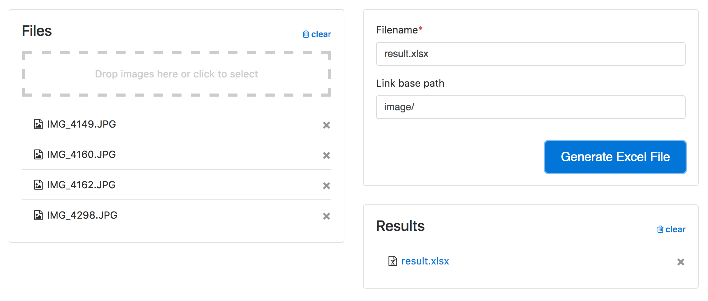

# Excel Links

A simple Node/React web app to write image links to an Excel file. If you need to link
to local image files from an Excel file you can use this app to create a list of links
you can copy/paste.

Server part is written in Node/Express, frontend in React. Based on
[`wbkd/yet-another-webpack-es6-starterkit`](https://github.com/wbkd/yet-another-webpack-es6-starterkit).




## Run locally

Development mode (dev server + hot module replacement):

```
npm run dev
```

Build production version:

```
npm run build
```

